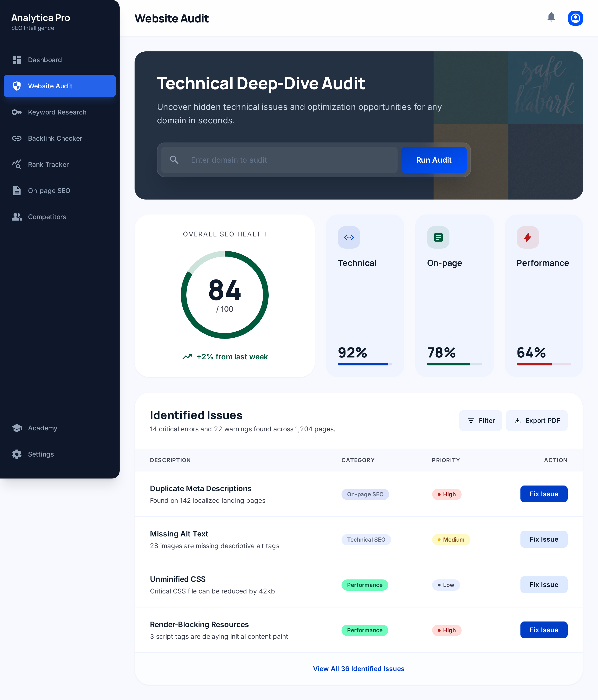
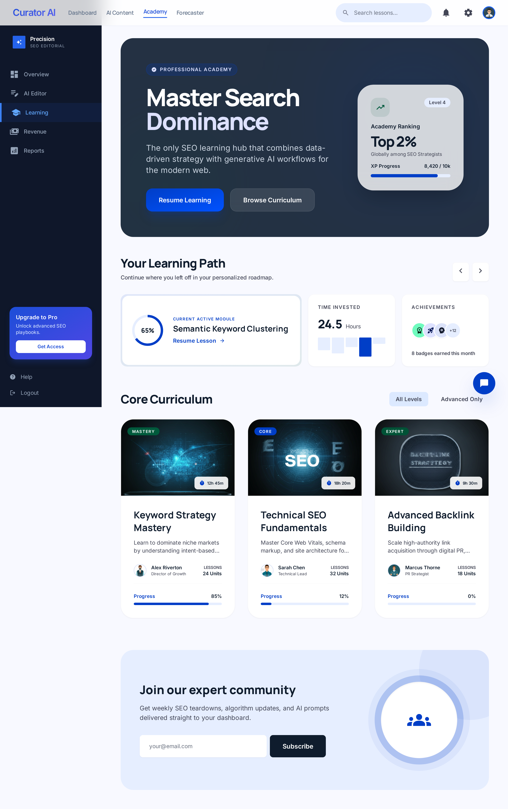
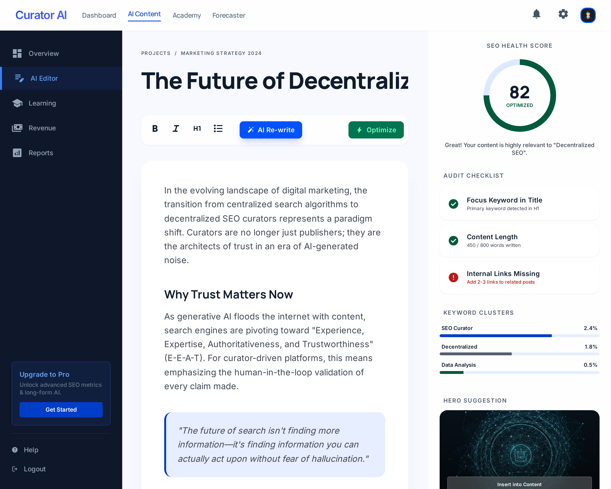
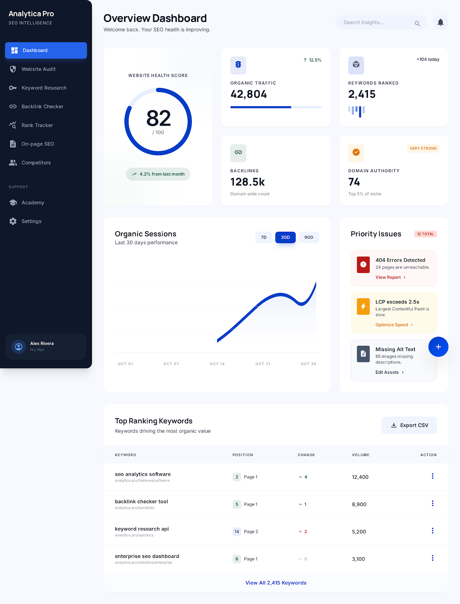
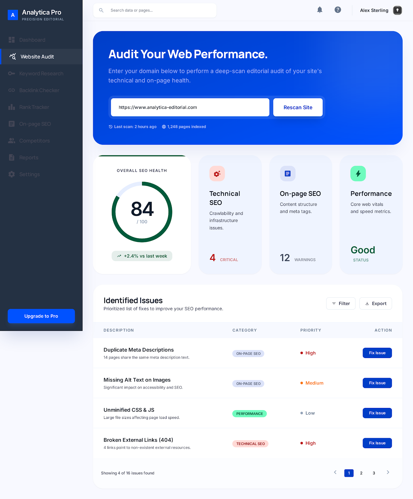
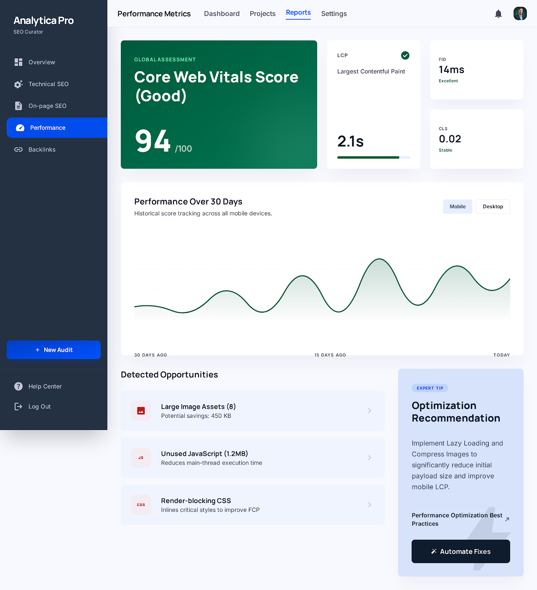
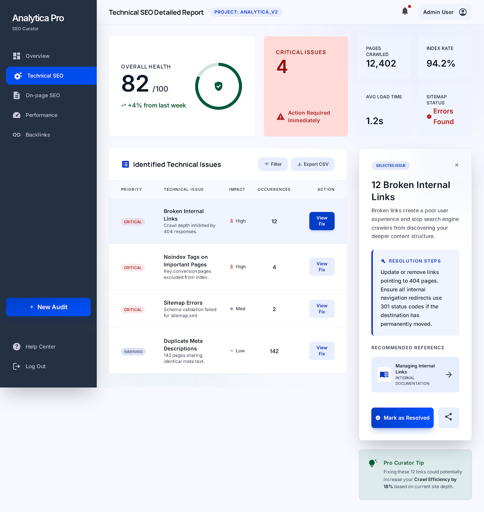
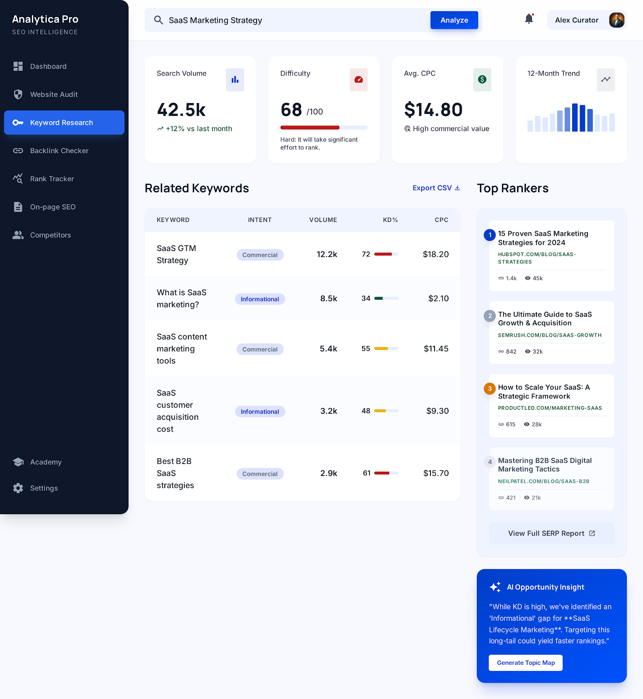
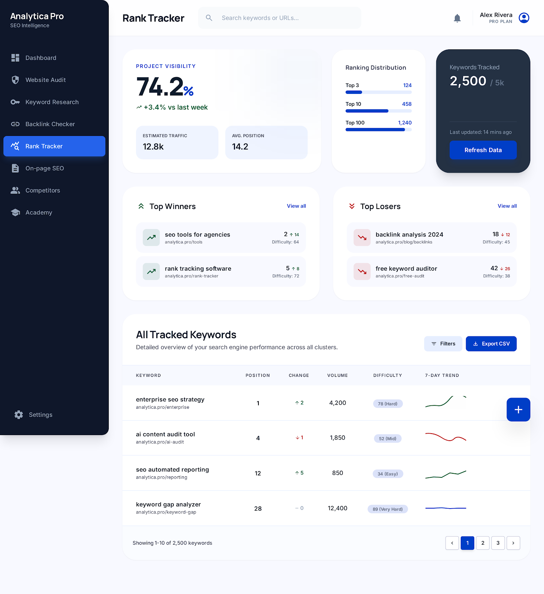
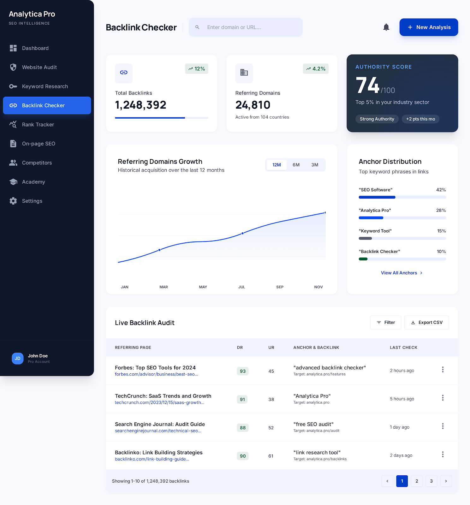

<div align="center">

# 🎯 SEO Analyst Platform

**Nền tảng phân tích SEO website tự động — Miễn phí, tiếng Việt, đủ dùng**

[](https://www.typescriptlang.org/)
[](https://nestjs.com/)
[](https://nextjs.org/)
[](https://www.postgresql.org/)
[](https://redis.io/)
[](#testing)
[](#deployment)

[](https://turborepo.com/)
[](https://playwright.dev/)
[](https://github.com/GoogleChrome/lighthouse)
[](https://docs.bullmq.io/)
[](https://www.prisma.io/)

[Features](#-features) · [Architecture](#-architecture) · [Quick Start](#-quick-start) · [Usage](#-usage) · **[User Guide](./docs/USER-GUIDE.md)** · [Docs](./docs/design/) · [PRD](./docs/PRD.md)

---



</div>

## 🔍 Vấn đề giải quyết

Công cụ SEO thương mại (Ahrefs, SEMrush, Moz) giá **$99–$499/tháng** — quá đắt cho:

- 🎓 Sinh viên học Digital Marketing
- 💼 Freelancer marketing mới vào nghề
- 🏪 Chủ SME Việt Nam với ngân sách hạn chế

→ **Platform này** miễn phí, tiếng Việt, chạy **< $40/tháng** infra, bao phủ **22 SEO rules** + site-wide crawl + scheduled audit + regression alert.

---

## ✨ Features

### Base (v1.0)

| Feature | Mô tả |
|---|---|
| 🔎 **Single-URL audit** | Paste URL → 22 rule SEO + Core Web Vitals + keyword density |
| ⚡ **Smart crawler** | Cheerio (nhanh) → Playwright fallback cho SPA |
| 📊 **Realtime progress** | WebSocket push tiến độ (discovery → crawl → analyze → report) |
| 📝 **Xuất PDF A4** | Báo cáo đẹp, hỗ trợ font Việt, có thể share public link |
| 🔄 **So sánh audits** | Compare 2 lần audit cùng domain, xem improvement/regression |
| 👨‍💼 **Admin panel** | Quản lý user, điều chỉnh rule weights runtime |

### Tier 1 Upgrade (v1.1 — 2026-04-18) 🚀

| # | Feature | Command / API | Impact |
|---|---|---|---|
| **F1** | 🌐 **Site-wide crawl** | `POST /audits { mode: "site", maxUrls: 500 }` | Audit cả domain qua sitemap.xml, không chỉ 1 URL |
| **F2** | ⏰ **Scheduled audits** | `POST /scheduled-audits { cron: "0 9 * * MON" }` | Lịch cron + regression alert (score drop ≥ 10) |
| **F3** | 📖 **Readability rule** | Flesch-Kincaid tự động (EN only) | Đánh giá độ dễ đọc content |
| **F4** | 🔗 **Broken-link audit** | `POST /audits { includeLinkChecks: true }` | HEAD/GET fallback, redirect chain, per-host limits |
| **F5** | 📱💻 **Dual Lighthouse** | Tự động cho mọi single-mode audit | Mobile + Desktop Core Web Vitals song song |

<details>
<summary>📸 <b>Screenshots gallery</b> (click to expand)</summary>

<br>

|  |  |
|:---:|:---:|
| **Learning Hub** — tutorial SEO cho beginner | **AI Generate** — gợi ý sửa issue dùng LLM |

<br>

**Stitch AI mockup set** (12 màn hình — xem [docs/design/stitch_d_n_m_i/](./docs/design/stitch_d_n_m_i/)):

| Dashboard | Website Audit | Performance | Technical SEO |
|:---:|:---:|:---:|:---:|
|  |  |  |  |

| On-Page SEO | Keyword Research | Rank Tracker | Backlink Checker |
|:---:|:---:|:---:|:---:|
|  |  |  |  |

</details>

---

## 🏗 Architecture

**6 services**: 1 Next.js frontend + 5 NestJS backend services, giao tiếp qua gRPC (sync) + BullMQ (async) + Redis pub/sub (events):

```
                     ┌──────────────────────────────────┐
                     │   apps/web (Next.js 14, :3001)   │
                     │  App Router · i18n (vi/en)       │
                     │  TanStack Query · Zustand · ky   │
                     │  shadcn/ui · Socket.IO client    │
                     └──────────────┬───────────────────┘
                                    │ HTTPS · /api/v1 + /ws
                                    ▼
┌──────────────────────────────────────────────────────────────────┐
│                    gateway  (NestJS, :3000)                      │
│  ── REST /api/v1/** (auth, audits, scheduled-audits, admin)      │
│  ── WebSocket /ws (realtime progress)                            │
│  ── BullMQ producer + gRPC client + Redis subscribers            │
│  ── F2 ScheduledAuditTickWorker + RegressionDetector             │
└────┬───────────────┬──────────────┬──────────────┬───────────────┘
     │ BullMQ        │ gRPC         │ gRPC         │ gRPC + HTTP
     │ (queue)       │ :50052       │ :50053       │ :50055
     ▼               ▼              ▼              ▼
┌──────────┐  ┌─────────────┐  ┌──────────┐  ┌────────────┐
│ crawler  │  │ seo-analyzer│  │ keyword- │  │  report    │
│ :50052   │  │  :50053     │  │ analyzer │  │  :50055    │
│          │  │             │  │  :50054  │  │  :3004     │
│ Cheerio  │  │ 22 rules    │  │ Tokenize │  │ Aggregate  │
│ Playwright│ │ Scoring     │  │ VI/EN    │  │ PDF        │
│ Lighthouse│ │             │  │ Density  │  │ Share link │
│ LinkChecker│ │             │  │          │  │            │
│ Sitemap   │ │             │  │          │  │            │
└──────────┘  └─────────────┘  └──────────┘  └────────────┘
     │              │                │              │
     └──────────────┴─── Redis 7 ────┴──────────────┘
        (BullMQ queues + pub/sub + cache + counters)

┌─────────┐    ┌─────────────┐    ┌──────────┐
│ seo_    │    │ seo_analyzer│    │ seo_     │
│ gateway │    │   (Postgres)│    │ report   │
│ (Postgres)│  │             │    │(Postgres)│
└─────────┘    └─────────────┘    └──────────┘
```

**Chi tiết đầy đủ:** [docs/design/00-system-overview.md](./docs/design/00-system-overview.md)

---

## 🖥️ Frontend (`apps/web`)

Next.js 14 App Router, chạy ở `:3001`, gọi Gateway qua `NEXT_PUBLIC_API_URL=http://localhost:3000`. Route được nhóm theo `[locale]/(app|auth)`:

| Route group | Pages | Mục đích |
|---|---|---|
| `(auth)` | `/login`, `/register`, `/forgot-password`, `/reset-password` | Public auth flow |
| `(app)` | `/dashboard` | Tổng quan + last audits |
| `(app)` | `/audits`, `/audits/[id]`, `/audits/compare` | Tạo audit, xem kết quả, so sánh 2 lần |
| `(app)` | `/scheduled` | CRUD scheduled audits (F2) + regression timeline |
| `(app)` | `/settings/{profile,password}` | User self-service |
| `(app)` | `/admin/{stats,users,rules}` | Admin panel — guard bằng `AdminGuard` |
| public | `/shared/[token]` | Public share link cho 1 audit (no auth) |

**Realtime:** Socket.IO client subscribe room `audit:<id>`, nhận `audit:progress` / `audit:completed` / `audit:failed`. Global modals: 401 (silent refresh), 403 AccountLocked, 429 RateLimit.

**Test layers:**
- **L1-L2** Vitest + Testing Library (component + hook + i18n)
- **L3** Playwright E2E với MSW handlers (FE-only hermetic)
- **L4** Playwright integration với **real gateway + real DB** (`playwright.integration.config.ts`) — chạy `npm --workspace @seo/web run test:integration` sau khi `docker:up`

> Dev FE không cần BE: xem `apps/web/CLAUDE.md` (mock harness mode trên branch `dev/mock-harness`).

---

## 🛠 Tech stack

| Layer | Tech | Why |
|---|---|---|
| **Language** | TypeScript 5.9 | Type-safe xuyên 6 service, giảm bug boundary |
| **Backend** | NestJS 10.4 | DDD-friendly modules, DI rõ ràng |
| **Frontend** | Next.js 14 (App Router) | SSR + streaming + RSC, port `:3001` |
| **FE data** | TanStack Query 5 + ky | Cache server state, retry/dedup tự động |
| **FE state** | Zustand 5 | Client state nhẹ (auth, UI toggles) |
| **FE forms** | react-hook-form + zod | Validate đồng nhất schema với BE DTO |
| **FE UI kit** | shadcn/ui (Radix) + Tailwind + Recharts | Primitive accessible + chart score |
| **i18n** | next-intl 4 | vi + en, route-based `[locale]` |
| **Monorepo** | Turborepo + npm workspaces | Cache build, task song song |
| **Database** | PostgreSQL 16 (3 schemas) | Service boundary = DB boundary |
| **ORM** | Prisma 5.22 | Migration + type gen + pooling |
| **Cache/Queue** | Redis 7 | BullMQ + pub/sub + rate-limiter 1 dep |
| **Jobs** | BullMQ 5.25 | Retry + dedup + [Job Scheduler v5](https://docs.bullmq.io/guide/job-schedulers) cho F2 |
| **gRPC** | @grpc/grpc-js 1.12 | Nhanh hơn REST ~3x, contract chặt |
| **Crawler** | Cheerio 1.0 + Playwright 1.50 | 2-tier: nhanh mặc định, fallback SPA |
| **Perf** | Lighthouse 12.2 | Chuẩn CWV, mobile + desktop (F5) |
| **Auth** | JWT (Passport) + bcrypt | Access 15m + refresh 7d rotation |
| **WebSocket** | Socket.IO 4.8 | Room-based, fallback polling |
| **PDF** | Playwright (Chromium) + Handlebars | HTML→PDF đẹp, font Việt |
| **Testing** | Vitest 2.x + supertest | ESM-native, nhanh hơn Jest |

---

## 🚀 Quick Start

### Prerequisites

- Node.js ≥ 18
- Docker + Docker Compose
- npm ≥ 11

### 1-command setup

```bash
git clone git@github.com:MinhDucoder/SEO-Analysts.git
cd SEO-Analysts
npm install                            # cài deps + postinstall: prisma generate
cp .env.docker.example .env.docker     # copy env template
npm run docker:up                      # bật full stack
```

Sau khi container ready (~60s, lần đầu ~5 phút):

| Endpoint | URL |
|---|---|
| **Web UI** (Next.js) | http://localhost:3001 |
| Gateway REST API | http://localhost:3000/api/v1 |
| Swagger / OpenAPI | http://localhost:3000/api/docs |
| Report service (PDF) | http://localhost:3004 |
| Postgres (gateway / analyzer / report) | 5432 / 5433 / 5434 |
| Redis | 6379 |

> **Chạy FE tách BE:** `npm --workspace @seo/web run dev` (BE phải `docker:up` trước, hoặc dùng mock harness — xem `apps/web/CLAUDE.md`).

### Seed dữ liệu test

```bash
bash scripts/seed-test-data.sh
# Tạo admin + 5 demo user với password "Test1234!"
```

**Test users:**
- `admin@test.seo.local` / `Test1234!` (role: admin)
- `duc@test.seo.local` / `Test1234!` (role: user)
- ... (xem `scripts/seed-test-data.sh`)

---

## 📖 Usage

### 🔹 Đăng ký + Login

```bash
# Register
curl -X POST http://localhost:3000/api/v1/auth/register \
  -H "Content-Type: application/json" \
  -d '{
    "email": "you@example.com",
    "password": "Strong1!Pass",
    "fullName": "Your Name"
  }'

# Login (trả accessToken + set refresh cookie)
curl -X POST http://localhost:3000/api/v1/auth/login \
  -H "Content-Type: application/json" \
  -d '{"email":"you@example.com","password":"Strong1!Pass"}' \
  -c cookies.txt

# Lưu accessToken
export TOKEN="<accessToken từ response>"
```

### 🔹 Single-URL audit (v1.0)

```bash
curl -X POST http://localhost:3000/api/v1/audits \
  -H "Authorization: Bearer $TOKEN" \
  -H "Content-Type: application/json" \
  -d '{
    "url": "https://example.com",
    "targetKeyword": "search engine"
  }'
# → 202 { auditId, status: "pending" }
```

### 🔹 🌐 Site-wide audit (F1, v1.1)

```bash
curl -X POST http://localhost:3000/api/v1/audits \
  -H "Authorization: Bearer $TOKEN" \
  -H "Content-Type: application/json" \
  -d '{
    "url": "https://example.com",
    "mode": "site",
    "maxUrls": 500
  }'
# → Audit toàn domain qua sitemap.xml, max 500 URL
# → Response cuối có: summary.avgScore, summary.worstPages[], summary.failedUrls
```

### 🔹 🔗 Broken-link audit (F4, v1.1)

```bash
curl -X POST http://localhost:3000/api/v1/audits \
  -H "Authorization: Bearer $TOKEN" \
  -H "Content-Type: application/json" \
  -d '{
    "url": "https://example.com",
    "includeLinkChecks": true
  }'
# → Crawler chạy HEAD/GET cho mọi <a href>
# → Rule broken_links: internal broken = FAIL, external broken = WARN
```

### 🔹 ⏰ Scheduled audit (F2, v1.1)

```bash
# Tạo lịch: mỗi thứ Hai 9h sáng
curl -X POST http://localhost:3000/api/v1/scheduled-audits \
  -H "Authorization: Bearer $TOKEN" \
  -H "Content-Type: application/json" \
  -d '{
    "url": "https://example.com",
    "cron": "0 9 * * MON",
    "mode": "site",
    "maxUrls": 250
  }'
# → 201 { id, isActive: true, ... }

# List lịch
curl http://localhost:3000/api/v1/scheduled-audits \
  -H "Authorization: Bearer $TOKEN"

# Pause / Resume / Delete
curl -X PATCH http://localhost:3000/api/v1/scheduled-audits/<id>/pause  -H "Authorization: Bearer $TOKEN"
curl -X PATCH http://localhost:3000/api/v1/scheduled-audits/<id>/resume -H "Authorization: Bearer $TOKEN"
curl -X DELETE http://localhost:3000/api/v1/scheduled-audits/<id>       -H "Authorization: Bearer $TOKEN"
```

### 🔹 WebSocket — realtime progress

```js
import { io } from 'socket.io-client';

const socket = io('ws://localhost:3000/ws', {
  auth: { token: accessJwt }
});

socket.on('connect', () => {
  socket.emit('audit:subscribe', { auditId });
});

socket.on('audit:progress', ({ progress, stage }) => {
  console.log(`[${stage}] ${progress}%`);
  // stages: crawling | analyze | report | site-crawl-discovery |
  //         site-crawl-fanout | site-crawl-audit | site-crawl-done
});

socket.on('audit:completed', ({ finalScore, summary }) => {
  console.log(`Score: ${finalScore}`);
  if (summary) {
    // F1 site-mode summary
    console.log(`Audited ${summary.auditedUrls}/${summary.totalUrls}`);
    console.log(`Worst page: ${summary.worstPages[0].url}`);
  }
});
```

### 🔹 Export PDF

```bash
curl -L http://localhost:3000/api/v1/audits/$AUDIT_ID/export \
  -H "Authorization: Bearer $TOKEN" \
  -o report.pdf
# → PDF A4 với cover page + issues + CWV + keywords
```

📚 **Full API reference:** [docs/design/21-api-contracts.md](./docs/design/21-api-contracts.md)

---

## 📂 Project structure

```
DO_AN/
├── apps/                       # 5 NestJS services + 1 Next.js frontend
│   ├── web/                    # Next.js 14 App Router (:3001)
│   │   ├── src/
│   │   │   ├── app/[locale]/   # (auth) + (app) route groups + /shared/[token]
│   │   │   ├── components/     # shadcn primitives + feature components
│   │   │   ├── lib/            # ky client, query keys, hooks, schemas
│   │   │   ├── i18n/           # next-intl config (vi, en)
│   │   │   └── messages/       # i18n catalogs
│   │   ├── tests/              # Vitest unit + Playwright E2E + L4 integration
│   │   └── playwright.integration.config.ts  # L4 real gateway + real DB
│   ├── gateway/                # REST + WebSocket + gRPC client (:3000)
│   │   ├── src/
│   │   │   ├── auth/           # JWT + Google OAuth + refresh rotation
│   │   │   ├── audits/         # POST/GET /audits + F1 subscribers
│   │   │   ├── scheduled-audits/  # F2 CRUD + TickWorker + RegressionDetector
│   │   │   ├── admin/          # User/rule/stats management
│   │   │   └── infra/          # Prisma + Redis + gRPC + WebSocket
│   │   └── prisma/             # 3 migrations (init, F1 PageAudit, F2 ScheduledAudit)
│   ├── crawler/                # Playwright + Cheerio + Lighthouse (:50052)
│   │   └── src/crawler/
│   │       ├── controllers/    # gRPC + 4 BullMQ workers (F1)
│   │       ├── services/       # orchestrator + counter + result store
│   │       └── infra/
│   │           ├── fetchers/   # Cheerio/Playwright/LinkChecker (F4)
│   │           ├── sitemap/    # F1 SitemapDiscovery
│   │           └── grpc/       # AnalyzerGrpcClient (F1)
│   ├── seo-analyzer/           # 22 SEO rules (:50053)
│   │   └── src/analyzer/domain/rules/
│   │       ├── meta/ (4) · headings/ (2) · images/ (2)
│   │       ├── links/ (3)      # + broken-links.rule (F4)
│   │       ├── technical/ (9) · performance/ (1)
│   │       └── content/ (1)    # readability.rule (F3)
│   ├── keyword-analyzer/       # Tokenize VI/EN + density (:50054)
│   └── report/                 # Aggregator + PDF + share (:3004 + :50055)
├── packages/
│   ├── shared/                 # Enums + interfaces + constants xuyên service
│   ├── proto/                  # gRPC proto definitions (5 services)
│   ├── ui/                     # Component primitives chia sẻ (shadcn-style)
│   ├── seo-ai-core/            # Logic AI helpers (issue → fix suggestion)
│   ├── seo-check-cli/          # Standalone CLI runner cho rule engine
│   ├── eslint-config/
│   └── typescript-config/
├── docs/
│   ├── PRD.md                  # Product Requirements Document v1.1
│   ├── PROJECT-GUIDE.md        # Pedagogical onboarding
│   ├── TIER1-*.md              # Tier 1 brainstorm + architecture + plans
│   └── design/                 # Full design documentation (8 core docs)
│       ├── 00-system-overview.md   # Big picture
│       ├── 01-gateway.md           # Gateway service
│       ├── 02-crawler.md           # Crawler service
│       ├── 03-seo-analyzer.md      # 22 rules detail
│       ├── 04-keyword-analyzer.md  # VI/EN tokenizer
│       ├── 05-report.md            # Aggregator + PDF
│       ├── 10-shared-packages.md   # @repo/* packages
│       ├── 20-data-model.md        # ERD + Redis keys
│       ├── 21-api-contracts.md     # REST + gRPC + WebSocket
│       ├── 22-job-pipeline.md      # BullMQ + choreography
│       └── 30-34-*.md              # Frontend architecture + specs
├── scripts/
│   └── seed-test-data.sh       # Admin + 5 demo users
├── docker-compose.yml
├── turbo.json
└── README.md                   # This file
```

---

## 💻 Development

### Run 1 service (hot-reload)

```bash
# Yêu cầu: Postgres + Redis đang chạy (docker-compose up postgres-* redis)
npm run dev:gateway         # or dev:crawler, dev:seo-analyzer, dev:keyword-analyzer, dev:report
```

### Common commands

```bash
npm run docker:up            # Full stack (5 services + 3 DB + Redis)
npm run docker:down          # Stop + remove containers
npm run docker:logs          # Follow logs tất cả service
npm run e2e:smoke            # End-to-end smoke test pipeline
```

### Prisma workflow

```bash
cd apps/gateway
npx prisma migrate dev --name add-xyz-field    # Tạo + apply migration (dev)
npx prisma generate                             # Regenerate client
npx prisma studio                               # GUI query DB
```

### Testing

```bash
npx turbo run test                              # Chạy tất cả unit + integration
npx turbo run test --filter=@seo/crawler        # 1 service
cd apps/crawler && npx vitest --watch           # Watch mode

# Frontend
npm --workspace @seo/web run test               # Vitest L1-L2
npm --workspace @seo/web run e2e                # Playwright L3 (MSW)
npm --workspace @seo/web run test:integration   # Playwright L4 (real gateway + DB)
```

**Test layers:**

| Layer | Scope | Stack |
|---|---|---|
| **L1-L2** BE unit/integration | 5 NestJS services | Vitest + supertest |
| **L1-L2** FE unit/component | `apps/web` hooks + components | Vitest + Testing Library |
| **L3** FE E2E (hermetic) | Page flows với MSW mocks | Playwright |
| **L4** FE↔BE integration | Real gateway + real Postgres | Playwright + docker-compose |
| **E2E smoke** | Full pipeline `crawl → analyze → report` | `scripts/e2e-smoke-test.sh` |

---

## 🚢 Deployment

**Prod stack (dự kiến < $40/tháng):**

| Component | Platform | Monthly |
|---|---|---:|
| Frontend (Next.js) | Vercel | Free / $20 Pro |
| Gateway + Report (HTTP) | Railway / Render | $5–15 |
| Crawler + Analyzer + Keyword (gRPC) | Railway / Fly.io | $10–20 |
| Postgres × 3 | Supabase free tier | $0 |
| Redis | Upstash (10k cmd/day) | $0 |
| Domain + CDN | Cloudflare | $0 |
| **Total** | | **< $40/mo** |

**Migration strategy:**
- Zero-downtime: mọi cột mới đều NULLABLE
- Prisma `migrate deploy` tự chạy khi container start (`docker-entrypoint.sh`)
- BullMQ Job Scheduler state survive Redis restart qua boot-time reconciler (F2)

---

## 📚 Documentation

| Doc | Mục đích | Audience |
|---|---|---|
| [USER-GUIDE.md](./docs/USER-GUIDE.md) | **User guide** — cách tối ưu SEO + dùng 4 mode audit + fix từng rule + monitoring strategy | End user, SEO freelancer, SME owner |
| [PRD.md](./docs/PRD.md) | Product Requirements (v1.1) — 22 rule detail, data model, API surface | Product owner, dev onboard |
| [docs/design/00-system-overview.md](./docs/design/00-system-overview.md) | Big picture: 5 service, công nghệ, data flow 1 audit | Dev, giảng viên chấm |
| [docs/design/01-05](./docs/design/) | Chi tiết từng service | Dev |
| [docs/design/10-shared-packages.md](./docs/design/10-shared-packages.md) | `@repo/shared` + `@repo/proto` | Dev |
| [docs/design/20-data-model.md](./docs/design/20-data-model.md) | ERD + Redis structures | DB admin, dev |
| [docs/design/21-api-contracts.md](./docs/design/21-api-contracts.md) | REST + gRPC + WebSocket reference | Frontend dev, tester |
| [docs/design/22-job-pipeline.md](./docs/design/22-job-pipeline.md) | BullMQ + choreography + F1/F2 flows | Backend dev |
| [docs/design/30-34](./docs/design/) | Frontend architecture + page specs + design system | Frontend dev |
| [docs/TIER1-ARCHITECTURE.md](./docs/TIER1-ARCHITECTURE.md) | Tier 1 architecture lock-in | Dev |
| [docs/TIER1-BRAINSTORM.md](./docs/TIER1-BRAINSTORM.md) | Tier 1 research + 20+ nguồn uy tín | Anyone curious |

---

## 🎯 Roadmap

- [x] **v1.0** (2026-04-17) — MVP: 20 rules, 1 URL, mobile Lighthouse
- [x] **v1.1** (2026-04-18) — **Tier 1**: site-wide + scheduled + broken links + dual Lighthouse + readability
- [x] **v1.2 FE** — Next.js frontend đầy đủ: dashboard, audits, compare, scheduled, settings, admin, public share, i18n vi/en
- [x] **v1.2 QA** — L4 FE↔BE integration harness (real gateway + real DB) + mock harness cho FE-only dev
- [ ] **v1.3** — Alert delivery (email/webhook/Slack) + regression timeline visualization
- [ ] **v2.0** — Backlink analysis, rank tracking, multi-tenant, white-label

---

## 🤝 Contributing

Đây là đồ án tốt nghiệp ĐH GTVT. Không nhận external contribution trong giai đoạn này, nhưng PR review + comment luôn welcome.

**Code style:**
- TypeScript strict mode + ESLint + Prettier
- Vitest cho unit/integration test
- TDD cho mọi feature: RED → GREEN → commit
- Commit convention: `feat(scope):`, `fix(scope):`, `chore(scope):`, `docs(scope):`

---

## 📜 License

ISC License. Đồ án tốt nghiệp — ĐH Giao thông Vận tải (UTC).

Copyright © 2026 [MinhDucoder](https://github.com/MinhDucoder).

---

<div align="center">

**Built with ❤️ for Vietnamese SEO community**

[⬆ Back to top](#-seo-analyst-platform)

</div>
