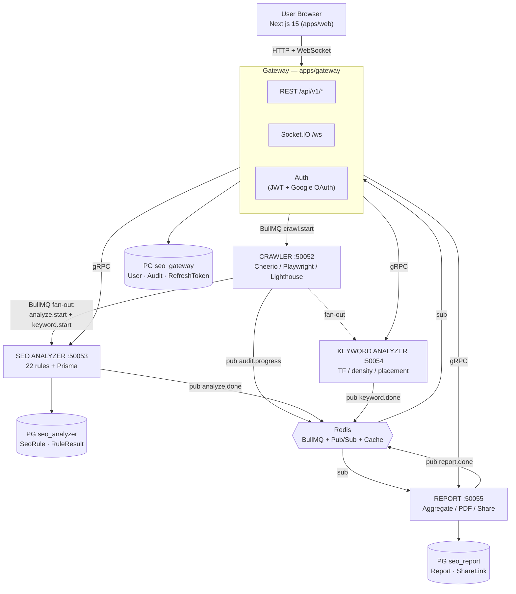
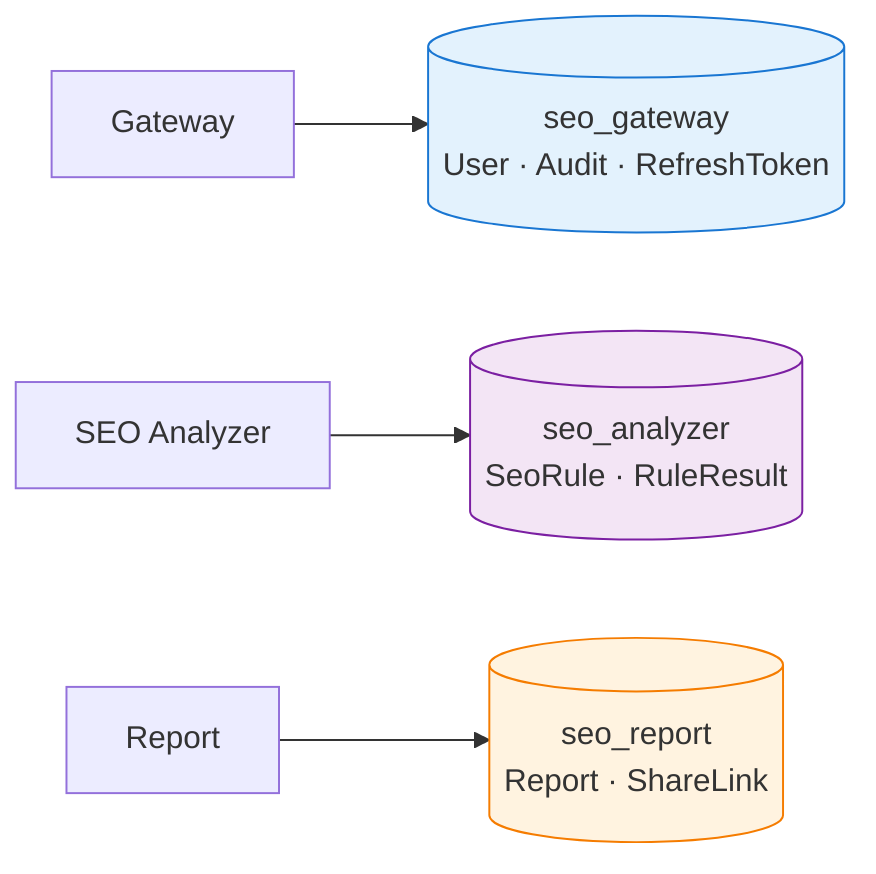

# SEO Analysts Platform — Tổng quan hệ thống

> **Mục đích**: một tài liệu duy nhất để (1) hiểu toàn bộ kiến trúc hệ thống và (2) trình bày trong 10–15 phút (hội đồng đồ án / đồng nghiệp / review).
>
> **Cách đọc**: đọc tuần tự từ §0 xuống §10. Mỗi mục đều tuân theo cấu trúc **What → Why → How → Trade-off** để người đọc nắm được cả quyết định thiết kế chứ không chỉ cấu trúc code.
>
> **Phiên bản số liệu**: branch `feat/seo-public-api` @ commit `7775f6a` · ngày cập nhật 2026-04-23.

---

## Mục lục

1. [TL;DR — Pitch 30 giây](#0-tldr--pitch-30-giây)
2. [Vấn đề & Giải pháp](#1-vấn-đề--giải-pháp)
3. [Bức tranh tổng thể (Big Picture)](#2-bức-tranh-tổng-thể-big-picture)
4. [5 Microservices — Chi tiết từng service](#3-5-microservices--chi-tiết-từng-service)
5. [Luồng một audit (Happy Path)](#4-luồng-một-audit-happy-path)
6. [3 cơ chế giao tiếp — khi nào dùng cái nào](#5-3-cơ-chế-giao-tiếp--khi-nào-dùng-cái-nào)
7. [Database boundary — vì sao 3 DB tách rời](#6-database-boundary--vì-sao-3-db-tách-rời)
8. [Tech Stack — lý do chọn](#7-tech-stack--lý-do-chọn)
9. [Số liệu & sức khoẻ codebase](#8-số-liệu--sức-khoẻ-codebase)
10. [Điểm nhấn khi trình bày & Q&A](#9-điểm-nhấn-khi-trình-bày--qa)
11. [Hạn chế & hướng phát triển (self-critique)](#10-hạn-chế--hướng-phát-triển-self-critique)

---

## 0. TL;DR — Pitch 30 giây

> **SEO Analysts** là nền tảng phân tích SEO (tương đương Ahrefs/SEMrush mức cá nhân), xây trên kiến trúc **5 microservices NestJS** giao tiếp qua **gRPC + BullMQ + Redis Pub/Sub**. Người dùng nhập một URL → hệ thống crawl trang, chấm 22 SEO rules, phân tích từ khoá, đo Core Web Vitals (Lighthouse), rồi tổng hợp thành báo cáo có thể **export PDF, share công khai và so sánh giữa hai lần audit**. Toàn bộ pipeline chạy async, tiến độ đẩy về client theo thời gian thực qua WebSocket.

| Hạng mục | Con số |
|---|---|
| Microservices | 5 (gateway · crawler · seo-analyzer · keyword-analyzer · report) |
| Frontend | 1 (Next.js 15.1 + React 19 + Tailwind + shadcn/ui) |
| Database | 3 PostgreSQL (database-per-service) + Redis (queue/cache/pub-sub) |
| Source files (apps/src) | 219 TS files · ~51.5K LOC |
| Tests | 64 test files · 499 `it()` blocks |
| SEO Rules | 22 rules · 7 categories |
| Inter-service contracts | 5 `.proto` files (analyzer · crawler · keyword · report · common) |
| Cost target | < $40/month (Railway + Supabase free tier) |

---

## 1. Vấn đề & Giải pháp

### Vấn đề

Công cụ SEO chuyên nghiệp như Ahrefs hay SEMrush đắt ($99–449/tháng) và quá nặng cho người dùng cá nhân hoặc SME. Các tool miễn phí như sitechecker hay seobility giới hạn 1–3 audit/tháng và thường không cho export PDF. Lighthouse trong Chrome DevTools chỉ đo performance, không có hệ thống rule SEO chuyên sâu, và không lưu lịch sử để so sánh giữa các lần audit.

### Giải pháp

Một SaaS audit SEO tự host được, kết hợp: crawler thực sự (Playwright fallback cho SPA, không chỉ HTTP fetch); 22 SEO rules custom (tương đương Screaming Frog bản basic) — mỗi rule có weight cấu hình được; Lighthouse Core Web Vitals chấm 30% điểm tổng; keyword analysis (TF, density, placement) cho target keyword; PDF report và share link công khai (ai có link cũng xem được, không cần login); và compare hai audit cùng domain để theo dõi tiến triển theo thời gian.

---

## 2. Bức tranh tổng thể (Big Picture)

> **Ý tưởng cốt lõi (1 câu)**: Gateway "cầm trịch" (orchestration) ở bước khởi đầu, sau đó các worker "tự diễn" (choreography) qua message queue và Redis events — tránh điểm nghẽn ở Gateway và cho phép scale từng service độc lập.

---

## 3. 5 Microservices — Chi tiết từng service

### 3.1 Gateway — `apps/gateway` (cổng vào duy nhất)

| Thuộc tính | Giá trị |
|---|---|
| Ports | HTTP `3000`, gRPC client `50051` |
| Tech | NestJS 10.4 + Prisma 5.22 + Socket.IO 4.8 + Passport (JWT, Google OAuth) |
| Database | `seo_gateway` — `User`, `Audit`, `RefreshToken` |
| Quy mô | 95 src files · 24.5K LOC · 16 test files · 112 `it()` blocks |

**Trách nhiệm**. Auth đầy đủ vòng đời (register, login, refresh token rotation, Google OAuth, verify-email, forgot-reset). Expose REST dưới `/api/v1/{auth,audits,users,admin,shared,health}` — đây là **public surface duy nhất** của toàn hệ thống. WebSocket `/ws` đẩy progress real-time về client. Rate-limit backed by Redis (audit/hour, login/15min, register/hour). Đóng vai trò orchestrator: nhận `POST /audits` → enqueue `crawl.start` vào BullMQ → trả `202 {auditId}` ngay, không block.

**Điểm đáng nói**. Refresh token được **rotated on use** và lưu dạng **hashed** trong DB; cookie HTTP-only scope hẹp (`/api/v1/auth`) → an toàn trước XSS/CSRF cơ bản. Đây là implement chuẩn OWASP chứ không dừng ở "JWT + localStorage" như nhiều project sinh viên.

### 3.2 Crawler — `apps/crawler` (lấy dữ liệu trang)

| Thuộc tính | Giá trị |
|---|---|
| Ports | gRPC `50052` (không expose HTTP) |
| Tech | NestJS + Playwright 1.50 + Cheerio + Lighthouse 12.2 + axios |
| Database | Không (stateless) — chỉ Redis cache `crawl:<hash>` / `lighthouse:<hash>` (TTL 1h) |
| Quy mô | 31 src files · 2.8K LOC · 20 test files · 186 `it()` blocks |

**Trách nhiệm**. URL validation (chống SSRF, blocklist private IP). Cheerio fetch HTML (nhanh) → detect SPA → fallback Playwright nếu cần render JS. Lighthouse Programmatic API cho Core Web Vitals (LCP, CLS, INP, TBT). `PageDataExtractor` chuẩn hoá dữ liệu cho analyzer và keyword. **Fan-out**: kết thúc crawl → enqueue đồng thời `analyze.start` và `keyword.start`.

**Điểm đáng nói**. **Browser pool** (`BROWSER_POOL_SIZE`) tránh cold-start Playwright cho mỗi request → giảm 2–3 giây/audit. Đây là micro-optimization có ROI rất cao vì Playwright cold-start tốn ~2s CPU mỗi lần.

### 3.3 SEO Analyzer — `apps/seo-analyzer` (rule engine)

| Thuộc tính | Giá trị |
|---|---|
| Ports | gRPC `50053` |
| Tech | NestJS + Prisma + 22 rules implement `ISeoRule` |
| Database | `seo_analyzer` — `SeoRule` (config), `RuleResult` (per-audit) |
| Quy mô | 46 src files · 10.2K LOC · 14 test files · 123 `it()` blocks |

**Trách nhiệm**. Chạy 22 rule trên `PageData` → trả `RuleCheckOutput` (PASS/FAIL/WARNING + score + issue). Tính category score (weighted avg) và overall score → lưu `RuleResult` rows. Admin API: list rules, update weight (cho phép chỉnh weight live mà không deploy).

**22 Rules chia 7 categories**:

| Category | Count | Rules |
|---|---|---|
| meta | 4 | title-tag, meta-description, open-graph, twitter-card |
| headings | 2 | h1-tag, heading-hierarchy |
| images | 2 | image-alt, image-optimization |
| links | 3 | internal-links, external-links, broken-links |
| content | 1 | readability |
| performance | 1 | page-size |
| technical | 9 | canonical-url, robots-meta, viewport-meta, https-check, schema-org, language-tag, favicon, http-status, url-structure |

**Điểm đáng nói**. `ISeoRule` interface + `RuleRegistry` → **Open/Closed Principle**: muốn thêm rule mới, chỉ cần 1 file implement interface + register vào registry; **không đụng vào engine**. Đây là kiến trúc cho phép scale rule count mà không làm phình code engine.

### 3.4 Keyword Analyzer — `apps/keyword-analyzer` (phân tích từ khoá)

| Thuộc tính | Giá trị |
|---|---|
| Ports | gRPC `50054` |
| Tech | NestJS stateless + tokenizer custom (vi/en stopwords) |
| Database | Không — kết quả cache Redis `keyword:result:<auditId>` |
| Quy mô | 16 src files · 727 LOC · 7 test files · 47 `it()` blocks |

**Trách nhiệm**. Tokenize → tính TF (term frequency). Density check cho `targetKeyword` (1–3% được coi là healthy). Placement check: keyword có xuất hiện ở title, H1, URL, hoặc 100 từ đầu không. Verdict: `missing` / `under-optimized` / `optimal` / `stuffed`.

**Điểm đáng nói**. **Service nhẹ nhất** (727 LOC) → ví dụ chuẩn mực của microservice "single responsibility". Có thể replace hoặc scale độc lập mà không ảnh hưởng phần còn lại — đây là lợi ích thực tế của service boundary chứ không phải lý thuyết suông.

### 3.5 Report — `apps/report` (tổng hợp + PDF + share)

| Thuộc tính | Giá trị |
|---|---|
| Ports | HTTP `3004` (PDF download), gRPC `50055` |
| Tech | NestJS + Prisma + Playwright (render PDF) + Handlebars (template) |
| Database | `seo_report` — `Report`, `ShareLink` |
| Quy mô | 31 src files · 13.2K LOC · 7 test files · 31 `it()` blocks |

**Trách nhiệm**. Listen Redis pub/sub `analyze.done` và `keyword.done` → đếm qua counter `WaitForBothService`. Khi đủ 2/2 → enqueue `report.start` → aggregate score theo công thức `0.7 × analyzer + 0.3 × CWV`. Persist `Report` row rồi publish `report.done` → Gateway WS đẩy cho client. Generate PDF (HTML template → Playwright render → buffer). Compare: `audit_a` vs `audit_b` → score delta + per-rule diff. Share link: tạo token random 32-byte hex (64 ký tự) → public viewer tại `/shared/audits/:token`.

**Điểm đáng nói**. `WaitForBothService` chính là **pattern join** cho 2 async stream (`analyze.done` + `keyword.done`) gặp nhau qua counter Redis. Không có nó, hoặc phải poll (tốn resource), hoặc race condition (report chạy với data thiếu). Đây là chỗ technical sâu nhất trong dự án — đáng dành 1–2 phút khi present.

---

## 4. Luồng một audit (Happy Path)

> Đây là phần kể chuyện khi present. Vẽ thành sequence diagram trên slide và kể theo storytelling.

| # | Bước | Actor | Cơ chế | Output |
|---|---|---|---|---|
| 1 | User submit URL | Frontend → Gateway | HTTP `POST /api/v1/audits` | `202 {auditId, status: pending}` |
| 2 | Gateway validate + enqueue | Gateway | BullMQ `crawl.start` | Job ID + Audit row trong `seo_gateway` |
| 3 | Frontend mở WebSocket | Frontend → Gateway | Socket.IO `audit:subscribe` | Join room `audit:<id>` |
| 4 | Crawler pick job, fetch HTML | Crawler | Cheerio → Playwright fallback | HTML + DOM |
| 5 | Crawler chạy Lighthouse | Crawler | chrome-launcher | Core Web Vitals |
| 6 | Crawler publish progress | Crawler → Redis | pub `audit.progress` (10/25/40%) | Progress event |
| 7 | Gateway forward progress | Gateway (subscriber) → Frontend | Socket.IO emit | Real-time progress bar |
| 8 | Crawler fan-out | Crawler → BullMQ | enqueue `analyze.start` + `keyword.start` | 2 jobs chạy song song |
| 9 | Analyzer chạy 22 rules | SEO Analyzer | Prisma `createMany RuleResult` | 22 rows + pub `analyze.done` |
| 10 | Keyword chạy TF/density | Keyword Analyzer | Tokenize + verdict | Redis cache + pub `keyword.done` |
| 11 | Report `WaitForBothService` đếm 2/2 | Report listener | Redis sub | Trigger `report.start` |
| 12 | Report aggregate + persist | Report worker | Prisma transaction | `Report` row + pub `report.done` |
| 13 | Gateway emit `audit:completed` | Gateway → Frontend | Socket.IO | UI redirect sang result page |
| 14 | User export PDF / share link | Gateway → Report | gRPC `GeneratePdf` / `CreateShareLink` | PDF buffer / share token |

**Thời gian điển hình**: **8–25 giây** tuỳ kích thước trang và có cần Playwright render JS hay không.

**Điểm "wow" để present**. Từ bước 8 trở đi, **không có service nào ra lệnh** — analyzer và keyword chạy song song, report tự lắng nghe event và tự khởi động khi đủ dữ liệu. Đây là **choreography**, đối lập với orchestration cứng ở bước 1–2. Hệ thống lai (hybrid): orchestration cho khởi đầu (đảm bảo consistency), choreography cho xử lý (đảm bảo loose coupling + scalability). Đây là pattern được khuyến nghị trong *Building Event-Driven Microservices* (Adam Bellemare, O'Reilly 2020) cho workloads có bước khởi đầu cần validation tập trung.

---

## 5. 3 cơ chế giao tiếp — khi nào dùng cái nào

| Cơ chế | Dùng khi | Ví dụ trong dự án |
|---|---|---|
| **gRPC** (synchronous) | Cần response ngay, low-latency, request-reply | Gateway → Report `GetReport`, `GeneratePdf`; Gateway → Analyzer admin `UpdateRuleWeight` |
| **BullMQ** (async job queue) | Long-running, có thể retry, cần fan-out | `crawl.start` → `analyze.start` + `keyword.start` → `report.start` |
| **Redis Pub/Sub** (event broadcast) | Choreography, fire-and-forget, nhiều subscriber | `audit.progress` → Gateway WS; `analyze.done` + `keyword.done` → Report |

**Ưu / nhược của từng cơ chế**:

| Cơ chế | Ưu | Nhược |
|---|---|---|
| gRPC | Type-safe qua `.proto`; binary payload nhỏ; streaming sẵn | Coupling chặt (cả caller và callee phải online); cần generate code |
| BullMQ | Retry/backoff/DLQ built-in; workers scale độc lập; có UI (BullBoard) | Phụ thuộc Redis; debug khó hơn HTTP vì bất đồng bộ |
| Redis Pub/Sub | Loose coupling tuyệt đối; real-time; broadcast tự nhiên | **Không persist** — subscriber offline khi event phát ra là mất luôn; không có delivery guarantee |

**4 quy tắc kỷ luật của dự án** (từ `apps/CLAUDE.md`):

1. **Service boundary = Postgres DB boundary**. Không service nào đọc DB của service khác. Muốn dữ liệu → gọi qua gRPC.
2. Inter-service: **gRPC** (sync) + **BullMQ** (async) + **Redis Pub/Sub** (events). Không thêm cơ chế khác tuỳ tiện.
3. **Chỉ Gateway** public HTTP; tất cả service khác backend-only.
4. Mỗi service own Prisma schema riêng; migration chạy tự động ở `docker-entrypoint.sh`.

---

## 6. Database boundary — vì sao 3 DB tách rời

**Lý do tách** (đây là decision-point đáng present):

- **Loose coupling**. Schema của Analyzer thay đổi không kéo theo migration ở Gateway — giảm blast radius của mỗi lần deploy.
- **Scale độc lập**. Analyzer ghi nhiều (22 rule × N audits) → có thể đặt DB instance riêng, tune connection pool riêng, chọn storage class khác.
- **Failure isolation**. DB analyzer down không có nghĩa là user không login được; chỉ pipeline audit dừng còn auth vẫn sống.
- **Compliance-ready**. Dễ phân quyền theo nhóm dữ liệu (audit data vs user PII vs report sharing) — quan trọng nếu sau này phải tuân GDPR/PDPA.

**Trade-off** (cần thẳng thắn khi present). Mất khả năng JOIN giữa `User` và `RuleResult` ở DB level → phải compose ở application layer (Gateway gọi Report qua gRPC để hợp nhất view). Query phức tạp kiểu analytics (ví dụ "top 10 user có audit score cao nhất") đòi hỏi aggregation service riêng hoặc ETL sang data warehouse. Đây là cái giá phải trả cho decoupling.

---

## 7. Tech Stack — lý do chọn

| Quyết định | Chọn | Vì sao | Lựa chọn thay thế đã cân nhắc |
|---|---|---|---|
| Backend framework | NestJS 10.4 | DI built-in, decorator pattern, DDD-friendly, gRPC support nguyên bản | Express thuần (thiếu cấu trúc), Fastify (ít opinion, ít ecosystem) |
| Inter-service sync | gRPC | Type-safe qua proto, binary nhỏ, streaming sẵn | REST JSON (chậm hơn, không type-safe) |
| Inter-service async | BullMQ | Battle-tested, Redis-backed (đã có Redis), retry/DLQ tốt, có BullBoard UI | RabbitMQ (thêm 1 broker), Kafka (overkill cho scale này) |
| ORM | Prisma 5.22 | Type-safe schema → TS, migration tự sinh, multi-DB tốt | TypeORM (nặng, kém type-safe), raw SQL (nhiều boilerplate) |
| DB | PostgreSQL 16 | JSON support, full-text search, mature, miễn phí trên Supabase | MySQL (kém JSON), MongoDB (không cần document model) |
| Crawl HTML default | Cheerio | Nhanh, ít RAM, API giống jQuery | Playwright always (chậm, tốn ~200MB/page) |
| Crawl HTML fallback | Playwright 1.50 | Chromium full, Lighthouse share được browser instance | Puppeteer (Google đã giảm ưu tiên), Selenium (chậm, Java-centric) |
| Core Web Vitals | Lighthouse 12.2 programmatic | Chuẩn Google, gọi được từ Node | PageSpeed Insights API (rate-limited, cần online) |
| PDF | Playwright + Handlebars | Tận dụng browser đã có, HTML/CSS quen thuộc | wkhtmltopdf (legacy), pdfkit (vẽ tay khổ) |
| Real-time | Socket.IO 4.8 + Redis adapter | Fallback long-polling, room-based, scale nhiều instance | SSE (1-way), raw WebSocket (thiếu adapter) |
| Frontend | Next.js 15.1 + React 19 + shadcn/ui | App Router + RSC, copy-paste components, Tailwind ergonomic | CRA (deprecated), Vite SPA (thiếu SSR) |
| Monorepo | Turborepo | Remote cache, pipeline DAG, npm workspaces native | Nx (overkill), Lerna (đã legacy) |
| Deploy | Railway + Supabase | Free tier đủ project sinh viên, GitHub integration | AWS (phức tạp, đắt), Heroku (free tier deprecated) |

---

## 8. Số liệu & sức khoẻ codebase

### 8.1 Code metrics (measured on `feat/seo-public-api` @ `7775f6a`)

| Service | Src files | LOC | Test files | `it()` blocks | Test : Function ratio |
|---:|---:|---:|---:|---:|---:|
| gateway | 95 | 24,556 | 16 | 112 | ~1.2 : 1 |
| crawler | 31 | 2,827 | 20 | 186 | ~1.4 : 1 |
| seo-analyzer | 46 | 10,199 | 14 | 123 | ~1.5 : 1 |
| keyword-analyzer | 16 | 727 | 7 | 47 | ~1.7 : 1 |
| report | 31 | 13,198 | 7 | 31 | ~0.4 : 1 |
| **Tổng** | **219** | **51,507** | **64** | **499** | — |

### 8.2 Cách đọc số này

Crawler có ratio tốt nhất (1.4:1 với nhiều scenario I/O) vì đây là service rủi ro nhất — network, browser, timeout, redirect loop — nên **cover kỹ là đúng ưu tiên**. Keyword-analyzer nhẹ nhất (727 LOC) với 47 tests → coverage rất dày vì logic tokenize dễ có edge case đa ngôn ngữ.

**Đáng chú ý**: Report chỉ có 31 `it()` blocks cho 13K LOC — đây là **red flag** cần cải thiện. Report là critical path cuối pipeline, chứa logic aggregation + PDF rendering + share-link, nên cần nhiều test hơn. Gateway 24.5K LOC cũng là service lớn nhất, cần theo dõi để không trở thành "distributed monolith".

### 8.3 Diagrams sẵn có trong repo

Tất cả lưu tại `diagrams/` dưới dạng PlantUML kèm PNG render sẵn:

- `08-architecture-microservices.puml` — kiến trúc tổng
- `14-erd-microservices.puml` — ERD 3 databases
- `15-sequence-audit-pipeline.puml` — sequence happy path
- `16-component-grpc-bullmq.puml` — communication map
- `19-class-rule-engine.puml` — class diagram rule engine

> **Khi present**: render PNG trước, đừng để dính bug PlantUML giữa demo.

---

## 9. Điểm nhấn khi trình bày & Q&A

### 9.1 5 điểm phải nhấn khi present

1. **Database-per-service không phải trang trí**. Mình thực sự bị **ép** không được JOIN cross-service; điều này khiến mình phải code aggregator ở Report qua gRPC. Đó là trade-off có chủ đích để đạt loose coupling, không phải "làm cho có".

2. **Hybrid orchestration + choreography**. Khác với saga thuần (toàn pub/sub) hoặc monolith ẩn (1 service ra lệnh tất cả). Khởi đầu cứng ở Gateway (đảm bảo validation tập trung), xử lý mềm ở workers (đảm bảo scalability) → cân bằng giữa dễ debug và dễ scale.

3. **22 SEO rules tuân Open/Closed**. `ISeoRule` interface + `RuleRegistry` → muốn thêm rule "alt text length > 5 chars" chỉ cần 1 file mới + register. **Không đụng vào engine**. Đây là ví dụ sống động của OCP trong codebase thực.

4. **WaitForBothService = pattern join**. Đây là chỗ technical sâu nhất. 2 async stream (`analyze.done` + `keyword.done`) gặp nhau qua Redis counter. Không có nó → hoặc phải poll (lãng phí), hoặc race condition (report thiếu data).

5. **Real-time qua Redis Pub/Sub + Socket.IO room**. Client không phải poll API. Crawler emit progress → Redis → Gateway subscriber → Socket.IO room → đúng tab user nhận. **Scale ngang được** vì Socket.IO dùng Redis adapter để chia sẻ state giữa các instance.

### 9.2 Q&A chuẩn bị trước

**"Sao không dùng monolith cho project sinh viên?"**
Vì mình dùng đồ án này như cơ hội học microservices đúng nghĩa. Cost vẫn thấp (< $40/m) do mỗi service nhẹ. Lợi ích cụ thể: crawler dùng Playwright nặng RAM được tách riêng — nếu monolith, một OOM kill nguyên app.

**"gRPC có thật sự cần?"**
Cho admin call (Gateway → Analyzer.UpdateRuleWeight) thì REST cũng được. Nhưng **proto là single source of truth** cho contract — sửa field thì TS compile fail ngay → bắt lỗi sớm hơn JSON runtime.

**"Sao không dùng Kafka thay BullMQ?"**
Scale dự án (audit/giờ) chưa đủ để cần partition log. BullMQ có retry/DLQ/UI đủ dùng và **đã có Redis** sẵn cho cache → không thêm broker mới để tránh phình stack.

**"Lighthouse có chính xác không?"**
Lighthouse là chuẩn Google, nhưng số biến thiên ±10% giữa các lần chạy do mạng và CPU. Mitigate bằng cache Redis 1h; kế hoạch: chạy nhiều lần lấy median (TODO).

**"Bảo mật có gì?"**
JWT + refresh token rotation + hashed storage. Rate-limit Redis. URL SSRF validator (chặn private IP). Cookie HTTP-only scope hẹp (`/api/v1/auth`). Share link random 32-byte token (64 ký tự hex), revoke được.

**"Test coverage thật sự bao nhiêu?"**
499 `it()` blocks / ~579 functions ≈ 0.86 : 1 toàn dự án. Crawler cao nhất (1.4:1) vì network rủi ro nhất. Report thấp nhất (0.4:1) — cần cải thiện. Chưa có integration test cross-service ngoài `e2e:smoke`.

**"Failure handling như nào?"**
BullMQ retry 3 lần exponential backoff. Job fail → publish `crawl.failed` → Gateway WS emit `audit:failed`. DLQ giữ job hỏng để debug.

**"Nếu Redis chết?"**
Toàn bộ async pipeline đứng (queue + pub/sub + cache + rate-limit). Đây là **single point of failure** — production sẽ cần Redis Sentinel hoặc Redis Cluster. Xem §10.

**"Dự định mở rộng?"**
Thêm Public API + API key (đang ở Plan 2/3). Multi-page crawl (sitemap-based). Backlink check (Common Crawl). AI-powered recommendations (`packages/seo-ai-core` đã setup).

### 9.3 Gợi ý cấu trúc trình bày 10–15 phút

| Phần | Thời lượng | Nội dung | Mục từ file này |
|---|---|---|---|
| Mở đầu | 1 phút | Vấn đề + giải pháp | §0, §1 |
| Big picture | 2 phút | Diagram tổng + ý tưởng cốt lõi | §2 |
| 5 services | 3 phút | Lướt nhanh, dừng kỹ ở Crawler + Report | §3 |
| Demo / Happy path | 4 phút | Vẽ sequence theo storytelling | §4 |
| Decisions đáng nói | 2 phút | Database boundary + 3 cơ chế giao tiếp | §5, §6 |
| Số liệu + self-critique | 1 phút | Code metrics + điểm yếu biết trước | §8, §10 |
| Q&A | 2–5 phút | — | §9.2 |

---

## 10. Hạn chế & hướng phát triển (self-critique)

> **Nguyên tắc khi present**: kể điểm yếu trước khi hội đồng hỏi ra. Thể hiện mình hiểu hệ thống chứ không phải "build theo template".

### 10.1 Những điểm mình biết là chưa tốt

**Redis là single point of failure**. Toàn bộ pipeline bất đồng bộ (queue + pub/sub + cache + rate-limit) phụ thuộc Redis. Sentinel/Cluster là giải pháp nhưng chưa triển khai vì chi phí ops.

**Không có distributed tracing**. Khi audit lỗi ở giữa pipeline, debug phải grep log từng service. Thêm OpenTelemetry + Jaeger/Tempo sẽ cho trace end-to-end rõ ràng hơn.

**Report service có coverage thấp (0.4:1)**. 13K LOC nhưng chỉ 31 `it()` blocks → critical path (aggregation + PDF + share) cần thêm test, đặc biệt edge case khi một trong hai event (`analyze.done` hoặc `keyword.done`) bị mất.

**Không có timeout rõ ràng cho `WaitForBothService`**. Nếu keyword service crash sau khi analyzer đã xong, counter sẽ kẹt ở 1/2 và audit treo pending mãi. Cần thêm timeout + dead-letter.

**Compensation / saga rollback thiếu**. Nếu analyze thành công nhưng keyword fail hoàn toàn (sau 3 lần retry), hiện trạng report chạy với data thiếu hoặc không chạy được — chưa có cơ chế "rollback audit" rõ ràng.

**Proto schema evolution chưa có quy tắc**. Chỉnh `.proto` là cross-service breaking change tiềm tàng. Cần quy trình: thêm field mới (additive) → migrate consumer → remove field cũ (≥ 1 sprint sau). Hiện quy tắc này nằm trong CLAUDE.md nhưng chưa có linting tự động.

**Observability dừng ở logging**. Chưa có metrics exporter (Prometheus) nên không biết p95 latency, queue depth, browser pool utilization. Với scale hiện tại thì tạm ổn, nhưng khi lên production cần bổ sung.

**Idempotency của crawl job chưa rõ ràng**. Nếu BullMQ retry sau partial success (crawler đã publish progress 50% rồi crash), chưa có cơ chế đảm bảo không double-process.

### 10.2 Hướng phát triển (roadmap)

**Ngắn hạn (1–2 sprint)**. Thêm Public API + API key management (đang ở Plan 2/3 — xem `docs/superpowers/plans/PLAN-2-HANDOFF.md`). Tăng test coverage cho Report. Thêm timeout cho `WaitForBothService`.

**Trung hạn**. Multi-page crawl theo sitemap. OpenTelemetry + Prometheus. Proto-lint để enforce backward compatibility. Redis Sentinel cho HA.

**Dài hạn**. Backlink check qua Common Crawl dataset. AI-powered recommendations sử dụng `packages/seo-ai-core` (đã scaffold). White-label / multi-tenant cho agency use case.

---

## 11. Tài liệu chi tiết

| Cần biết về | Đọc |
|---|---|
| Map tổng cross-service + data flow | [`apps/CLAUDE.md`](../apps/CLAUDE.md) |
| Per-service DDD layout | `apps/<service>/CLAUDE.md` |
| Quick reference (paths, ports, packages) | [`.claude/context/index.md`](../.claude/context/index.md) |
| Tech stack versions | [`.claude/context/tech-stack.md`](../.claude/context/tech-stack.md) |
| Diagrams (PlantUML + PNG) | [`diagrams/INDEX.md`](../diagrams/INDEX.md) |
| Microservices architecture spec | [`docs/superpowers/specs/2026-04-09-microservices-architecture-design.md`](./superpowers/specs/2026-04-09-microservices-architecture-design.md) |
| Public API plan (đang làm) | [`docs/superpowers/plans/PLAN-2-HANDOFF.md`](./superpowers/plans/PLAN-2-HANDOFF.md) |
| Code knowledge graph (interactive) | `.code-review-graph/graph.html` (mở browser) |

---

> **Mẹo cuối cho người present**: luôn nói **"why"** trước **"what"**. Người nghe sẽ quên cấu trúc folder sau 5 phút, nhưng sẽ nhớ "vì sao tách 3 DB" — đó là thứ thể hiện bạn hiểu hệ thống chứ không chỉ build theo template.
